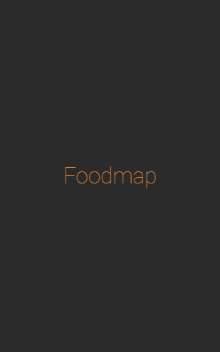
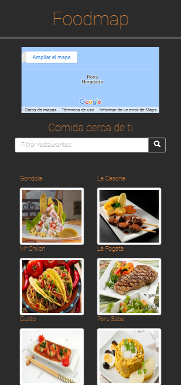
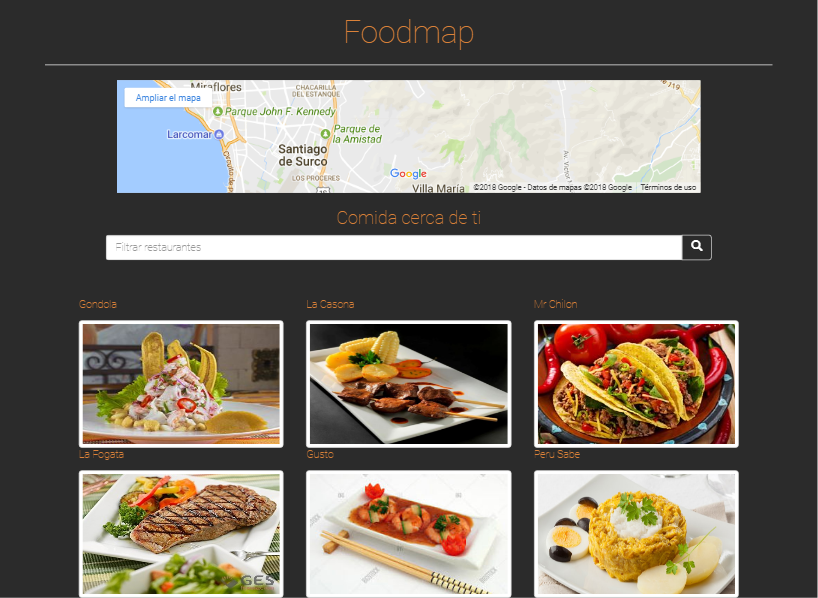
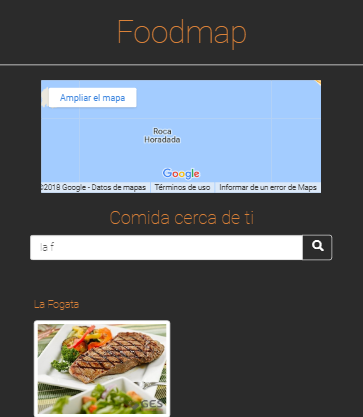
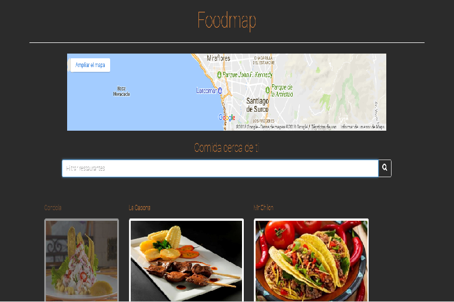
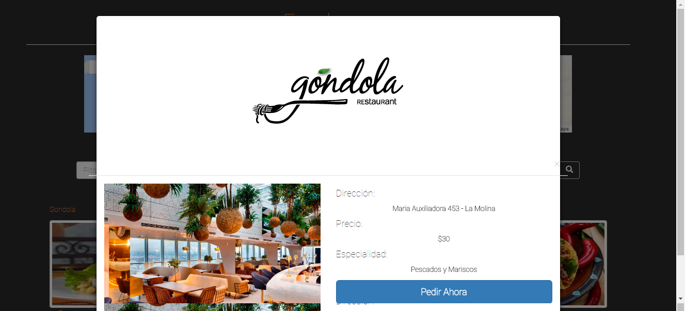

# ***EJERCICIO FOODMAP***

# *Objetivo:*

> ### *Crea una web-app que a través de un input pueda filtrar los restaurantes que se encuentran cerca de ti (Tú decides la estructura que tendrán tus datos, puedes crear una lista de restaurantes en un arreglo, en un objeto, de manera individual. El diseño es totalmente libre).:*

## *FLUJO DE LA APLICACIÓN:*

1. Vista splash con duración de 2 a 5 segundos que redirecciona a tu vista principal.

2. En la vista principal se muestran todos los restaurantes "cerca de ti" junto con el input para filtrar tu elección (Los criterios de filtrado son decisión tuya, puede ser por tipo de comida, costos, orden alfabético, etc.).

3. Ya que se hizo la elección del filtro deben mostrarse únicamente aquellos restaurantes que cumplan con la condición.

4. Agrega un evento mouseover a las imágenes, lo que pase con el efecto es decisión tuya (Cambio de tamaño, muestra de texto, cambio de imagen, información, etc).

5. Al seleccionar alguno de los restaurantes, deberá mostrarse la información de este a través de un modal.

6. Una vez cerrado el modal debe volver a la vista principal.

--------------------------------------------

## ***Trabajo realizado por Wendy Tamara***

* Se realizo la pagina web adaptable (responsive) tanto para desktop como para dispositivos moviles, utilizando bootstrap.

## *vista splash:*

## *vista principal - movil:*

## *vista principal - desktop:*

## *Filtro por nombre:*

## *Evento mauseover:*

## *modal:*

## *Proyecto desplegado en:*

* [gh-pages](https://wendytamara.github.io/foodmap/ "foodmap")
